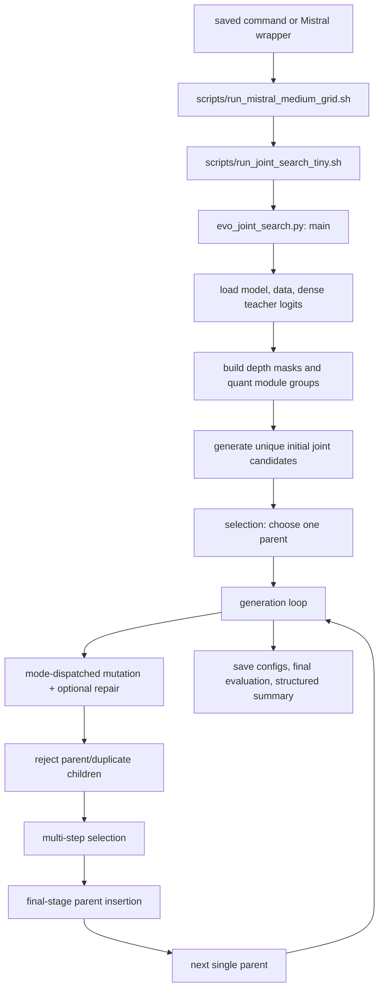

# Algorithm Audit: Current Joint Compression Search vs. EvoPress

## 1. Executive Summary

The current joint search is a single-parent `(1 + λ)` evolutionary search whose candidate is a Python dictionary containing two depth masks and a grouped, per-module bit-width state. It preserves EvoPress's central search skeleton: generate every offspring from one persistent parent, screen offspring in several increasingly expensive stages, insert the parent for elitism at the last configured stage, and make the best final survivor the next parent. There is no crossover. Evidence: `evo_joint_search.py`, `main`, lines 945–986 and 990–1191.

The implementation is nevertheless more than a direct transcription of Algorithm 1. It searches two compression spaces at once, fixes a structural removal count separately for attention and MLP modules, optionally defines the quantization budget over only modules that remain active, and introduces several mutation policies. The default `standard` policy chooses either a depth mutation or a quantization mutation; an older optional `--joint_aware_mutation` adds probabilistic coupled attention/quantization moves; the newer `interaction_aware` mode changes depth and quantization in every offspring. Evidence: `evo_joint_search.py`, `parse_args`, lines 704–783; `main`, lines 1073–1131.

The latest recorded completed joint-search experiments are not using the CLI default. The latest Mistral `q_proj` and full-attention runs use `joint_mutation_mode=interaction_aware`, `active_quant_budget=true`, `group_rule=size`, 50 generations, 16 offspring, 32 initial candidates, and selection schedules of `8 → 2 → 1` survivors on `512 → 2048 → 8192` input tokens. The most recent attention-scope run uses the same interaction-aware mode and budget settings. Evidence: `results/runs/thesis_interactionaware_joint_mistral_s0.25_qproj3.0_g50_o16_seed0/command.sh`, line 4; `results/runs/thesis_interactionaware_joint_mistral_s0.25_qproj3.0_g50_o16_seed0/run_summary.json`, lines 12–33 and 224–249; `results/runs/thesis_attention_interactionaware_joint_mistral_s0.25_attention3.0_g50_o16_seed0/command.sh`, line 4; `results/runs/thesis_attention_interactionaware_joint_mistral_s0.25_attention3.0_g50_o16_seed0/run_summary.json`, lines 12–33. By contrast, the base launcher and medium-grid launcher still default to standard mutation; evidence: `scripts/run_joint_search_tiny.sh`, lines 25–35 and 111–169; `scripts/run_mistral_medium_grid.sh`, lines 20–40 and 383–416.

The “joint budget” is not one scalar total-model compression constraint. It is the conjunction of:

1. exactly `floor(drop_sparsity × number_of_decoder_layers)` dropped attention modules and the same number of dropped MLP modules (or identical masks when whole blocks are tied); and
2. in the active-budget experiments, an exact target average bit-width independently inside every equal-parameter-count group, considering only searched projections whose enclosing attention/MLP module is active.

The reported total compressed model size is calculated afterward and is not used to accept, repair, or rank candidates. Evidence: `evo_joint_search.py`, `make_random_drop_state` and `mutate_drop_state`, lines 249–294; `repair_active_quant_budget`, lines 352–416; `main`, lines 814–825 and 917–965; `src/run_reporting.py`, `compute_compression_metrics`, lines 223–370.

The most consequential extensions relative to Algorithm 1 are the composite candidate, mixed or coordinated mutation operators, active-gene budget repair, and configurable mutation-strength schedules. The most consequential deviations or implementation caveats are:

- With the integer target used in the tracked experiments (`3.0`), every initial candidate starts with the same uniform quantization state; initial selection explores depth masks only. Evidence: `evo_joint_search.py`, `make_initial_quant_state`, lines 419–461; `main`, lines 945–983.
- A nominal “depth” offspring can also acquire quantization changes through active-budget repair. Evidence: `evo_joint_search.py`, `main`, lines 1105–1120.
- Repair is randomized, can change unrelated active genes, has no iteration limit, and raises rather than rejecting the candidate if no one-step repair is available. Evidence: `evo_joint_search.py`, `repair_active_quant_budget`, lines 352–416.
- Offspring-generation retries and calibration-minibatch sampling have no maximum attempt count. In degenerate search spaces or if a selection request exceeds the available unique calibration sequences, either loop can fail to terminate. Evidence: `evo_joint_search.py`, `sample_minibatch`, lines 122–153; `main`, lines 1073–1136.
- Parent insertion is detected by comparing a stage's survivor count with the final survivor count, not by testing the stage index. It is correct for the recorded `8,2,1` and `4,2,1` schedules, but a schedule containing `1` before the final stage would insert the parent early. Evidence: `evo_joint_search.py`, `main`, lines 812–813 and 1158–1163.
- Generation-log rows describe the parent and fitness from the start of the generation while also recording the mutation outcome and selected-parent provenance from the end of that generation. Evidence: `evo_joint_search.py`, `main`, lines 990–1045 and 1184–1301.

No source-level ambiguity remains about the active control flow. Open questions remain about intended behavior in untested or weakly guarded edge cases—especially non-unit repair steps, infeasible mutation spaces, repeated survivor counts, fractional targets, and whether “touched layer” should mean the same structural subcomponent rather than merely the same decoder-layer index.

## 2. Scope and Repository Files Inspected

### Authoritative active path

The authoritative joint-search implementation for this audit is the current working-tree version of `evo_joint_search.py`. The launcher sets `EVO_JOINT_SEARCH_SCRIPT=evo_joint_search.py` unless explicitly overridden, constructs the full command, conditionally adds the active-budget and mutation flags, and executes it. Evidence: `scripts/run_joint_search_tiny.sh`, lines 43–48, 101–169, and 374–437.

For the thesis-scale Mistral experiments, `scripts/run_mistral_medium_grid.sh` supplies the model, quantization database, search schedule, active-budget setting, and output identity to `scripts/run_joint_search_tiny.sh`. Evidence: `scripts/run_mistral_medium_grid.sh`, lines 8–47 and 290–416. The broader attention wrapper changes the quantization database from `q_proj`-only to all attention projections and then delegates to the same medium-grid launcher. Evidence: `scripts/run_mistral_attention_scope_grid.sh`, lines 56–85.

The latest recorded interaction-aware commands are stronger evidence of what was actually run than launcher defaults: their saved `command.sh` files invoke `evo_joint_search.py` directly with `--joint_mutation_mode interaction_aware --active_quant_budget --group_rule size`. Evidence: `results/runs/thesis_interactionaware_joint_mistral_s0.25_qproj3.0_g50_o16_seed0/command.sh`, line 4; `results/runs/thesis_attention_interactionaware_joint_mistral_s0.25_attention3.0_g50_o16_seed0/command.sh`, line 4.

### Files inspected and their role

| File or source | Role in this audit | Authority |
|---|---|---|
| `evo_joint_search.py` | Joint candidate, initialization, all active/optional mutation modes, repair, evaluation, selection, loop, and saving | Primary |
| `scripts/run_joint_search_tiny.sh` | Direct launcher, defaults, flag translation, command capture, run logging, and validation | Primary launcher |
| `scripts/run_mistral_medium_grid.sh` | Thesis-scale model/search defaults and delegation to the direct launcher | Primary experiment orchestrator |
| `scripts/run_mistral_attention_scope_grid.sh` | Broader attention-projection database and schedule overrides | Active wrapper |
| Saved `results/runs/**/command.sh`, `run_summary.json`, `final_candidate.json`, `generation_log.csv` | Actual executed flags, candidate format, and observed modes | Primary experiment evidence |
| `src/model_utils.py` | Decoder-layer lookup, dummy forwards, module sorting, and grouping | Primary dependency |
| `src/data_utils.py` | Calibration/evaluation data construction and token-count interpretation | Primary dependency |
| `src/metrics.py` | Perplexity and KL definitions | Primary dependency |
| `src/common_utils.py` | Random seeding | Primary dependency |
| `src/run_reporting.py` | Candidate serialization and post-search compression accounting | Primary reporting dependency |
| `quant.py`, `src/quantizer.py` | Meaning and on-disk form of quantization levels | Database-preparation dependency |
| `tests/test_joint_aware_mutation.py` | Focused behavioral checks for coupled mutation and schedules | Corroborating, not control-flow authority |
| `evo_drop_search.py`, `evo_quant_search.py`, `evo_prune_search.py` | Separate depth-only, quant-only, and sparse-allocation searches | Active baselines, not the joint path |
| `evo_joint_attribution.py` | Recombination/replay analysis using final candidates | Post-search analysis, not a search |
| Local Git refs `upstream/main` and `upstream/multimodal_search` | Repository-resident official EvoPress implementations used for three-layer comparison | Reference only |

Evidence for the roles above: `README.md`, lines 13–29 and 53–77; `evo_joint_attribution.py`, module docstring and imports, lines 1–51; `quant.py`, lines 1–20; `src/quantizer.py`, `_quant_group`, lines 152–180.

### Files not treated as authoritative for the joint loop

`docs/interaction_aware_joint_mutation.md`, planning notes, presentations, result summaries, and parser/summarizer scripts were used to locate experiments but not to infer algorithm behavior when executable code was available. `evo_joint_attribution.py` explicitly identifies itself as an analysis tool rather than a search algorithm and only replays/recombines candidates. Evidence: `evo_joint_attribution.py`, lines 1–8 and 92–129.

The depth-only, quant-only, and unstructured-pruning searches remain executable and are launched for baseline experiments, but none is imported or called by `evo_joint_search.py`; the joint script reimplements the required mechanisms. Evidence: `evo_joint_search.py`, imports, lines 1–37; `scripts/run_mistral_medium_grid.sh`, `run_search`, lines 290–416.

### How the active path was determined

The path was traced from saved commands and shell launchers to the Python `__main__` guard, then through `main`, `selection`, `apply_joint_state`, the mutation functions, and the reporting helpers. The Python entry point is `main()` under the module guard. Evidence: `evo_joint_search.py`, lines 804–853 and 1450–1451.

The latest run summaries record their Git commit, search configuration, compression configuration, artifacts, and final metrics. This makes it possible to distinguish old optional joint-aware runs from the newer interaction-aware runs. Evidence: `results/runs/thesis_jointaware_joint_mistral_s0.25_qproj3.0_g50_o16_seed0/run_summary.json`, lines 1–26; `results/runs/thesis_interactionaware_joint_mistral_s0.25_qproj3.0_g50_o16_seed0/run_summary.json`, lines 1–34 and 105–134.

## 3. EvoPress Algorithm 1

### 3.1 Conceptual description

The paper algorithm supplied for this audit is a `(1 + λ)` evolutionary algorithm. It samples initial candidates, selects one parent, creates `λ` mutated copies of that parent, progressively screens the offspring on more calibration tokens with fewer survivors, adds the current parent only in the final screening stage, and uses the best final candidate as the next parent.

A paper candidate is a vector of compression levels. A level switch increases one compatible unit's compression level and decreases another's, preserving the compression constraint. The practical implementation may apply more than one switch per offspring. The paper maintains one persistent parent and does not use crossover.

### 3.2 Reference pseudocode

```text
ALGORITHM EvoPress_Algorithm_1
    candidates ← []
    for i ← 1 to initialCandidates do
        candidates.append(sampleUniformly())
    end for

    parent ← selectTopKFittest(
        candidates,
        tokens = initialTokens,
        K = 1
    )[0]

    for generation t ← 1 to ∞ do
        offspring ← []

        for i ← 1 to λ do
            child ← COPY(parent)
            child ← LevelSwitchMutation(child)
            offspring.append(child)
        end for

        for step ← 1 to selectSteps do
            if step = selectSteps then
                offspring.append(parent)       // elitism
            end if
            offspring ← selectTopKFittest(
                offspring,
                tokens = tokens[step],
                K = survivors[step]
            )
        end for

        parent ← offspring[0]
    end for
END ALGORITHM
```

### 3.3 Important details from the paper that are not explicit in the pseudocode

- “Level switch” is a constraint-preserving exchange between compatible units, rather than an unconstrained random gene change.
- Several level switches may be applied to one child.
- Multi-step selection is a compute-allocation strategy: broad/cheap early screening and narrow/expensive late screening.
- The parent is included only at the final stage, so an offspring must beat it under the most expensive comparison to replace it.
- The population size is conceptually one even though a transient survivor set exists inside a generation.
- There is no recombination/crossover path.

These points are taken from the paper description supplied in the audit request and are the comparison baseline used below.

## 4. Current Implementation: Execution Path

The active call chain is:



Textual trace:

1. The Mistral grid builds per-method and per-seed run IDs and delegates joint runs to `scripts/run_joint_search_tiny.sh`. Evidence: `scripts/run_mistral_medium_grid.sh`, `run_search`, lines 290–416.
2. The direct launcher builds the full CLI, validates flag combinations, writes an exact reproducible `command.sh`, captures stdout and resource samples, and runs `evo_joint_search.py`. Evidence: `scripts/run_joint_search_tiny.sh`, lines 101–169, 181–231, and 374–456.
3. `main()` validates schedules and mutation/budget combinations, seeds randomness, loads the dense model/tokenizer/data, and caches dense calibration logits for KL fitness. Evidence: `evo_joint_search.py`, `main`, lines 804–908.
4. It discovers decoder layers and quantization-database module directories, sorts and groups module names, initializes the model's loaded-quant-state tracker, and constructs initial joint candidates. Evidence: `evo_joint_search.py`, `main`, lines 909–970.
5. `selection()` chooses one initial parent; the fixed-generation loop evaluates the current parent for reporting, generates unique offspring, performs staged selection with elitism, and updates the parent. Evidence: `evo_joint_search.py`, `selection`, lines 156–184; `main`, lines 972–1191.
6. The script saves raw and presentation-oriented candidate formats, performs full final evaluations, computes reporting-only compression metrics, and writes the final summary. Evidence: `evo_joint_search.py`, `main`, lines 1303–1447.

The latest tracked q-projection and attention-projection runs bypass no part of this chain: their saved commands point directly at `evo_joint_search.py` and their summaries identify `search_type=joint_depth_quant` artifacts produced by this script. Evidence: `results/runs/thesis_interactionaware_joint_mistral_s0.25_qproj3.0_g50_o16_seed0/command.sh`, line 4; `results/runs/thesis_interactionaware_joint_mistral_s0.25_qproj3.0_g50_o16_seed0/run_summary.json`, lines 1–10 and 224–249.

## 5. Current Candidate Representation

### 5.1 Depth component

The depth state is a dictionary with two Boolean lists:

```python
candidate["drop"] = {
    "attn": [bool, ...],  # one entry per decoder layer
    "mlp":  [bool, ...],  # one entry per decoder layer
}
```

`True` means the submodule is removed from the effective forward pass. The implementation does not delete the object; it replaces attention's forward with a zero-output function and MLP's forward with a zero-output function, so the enclosing residual path bypasses that submodule's contribution. Evidence: `evo_joint_search.py`, `load_drop_state`, lines 55–70; `src/model_utils.py`, `dummy_initialize`, `make_dummy_forward`, and `restore_forward`, lines 131–157.

With `drop_entire_block=false`—the setting in the recorded Mistral runs—the attention and MLP masks are initialized independently and mutated independently. With `drop_entire_block=true`, the MLP mask is always copied from the attention mask after initialization or mutation. Evidence: `evo_joint_search.py`, `make_random_drop_state`, lines 249–266; `mutate_drop_state`, lines 269–294; current run evidence: `results/runs/thesis_attention_interactionaware_joint_mistral_s0.25_attention3.0_g50_o16_seed0/run_summary.json`, lines 22–33.

### 5.2 Quantization component

The quantization state is a nested Python list:

```python
candidate["quant"] = [
    [bit_for_module_0_in_group_0, bit_for_module_1_in_group_0, ...],
    [bit_for_module_0_in_group_1, bit_for_module_1_in_group_1, ...],
    ...
]
```

Each integer is the filename stem of a precomputed reconstruction such as `2.pth`, `3.pth`, or `4.pth`. Quantized database files contain dequantized floating-point reconstructions, and search activation copies the selected tensor into the existing module's `weight.data`; it does not instantiate packed low-bit operators during search. Evidence: `quant.py`, lines 1–20; `src/quantizer.py`, `_quant_group`, lines 152–180; `evo_joint_search.py`, `load_quant_layers`, lines 73–96.

Module names are discovered from subdirectories of `quant_weights_path`, sorted by decoder-layer number and then remaining name components, and partitioned by `group_rule`. `size` groups modules with the same weight `numel`, `name` groups by final name component, and `none` places everything in one group. Evidence: `evo_joint_search.py`, `main`, lines 926–939; `src/model_utils.py`, `layer_order_fn` and `group_layers`, lines 363–383.

Different projection types are therefore separate genes, but not necessarily separate groups. In the latest full-attention Mistral database, `k_proj`/`v_proj` and `q_proj`/`o_proj` form equal-size groups; an exchange can cross projection names inside an equal-size group. The final candidate contains assignments for all four projection types and two raw quant groups. Evidence: `results/runs/thesis_attention_interactionaware_joint_mistral_s0.25_attention3.0_g50_o16_seed0/final_candidate.json`, lines 36–130 and 238–370; `results/runs/thesis_attention_interactionaware_joint_mistral_s0.25_attention3.0_g50_o16_seed0/run_summary.json`, lines 12–33; grouping implementation: `src/model_utils.py`, `group_layers`, lines 369–383.

### 5.3 Joint representation

The complete in-memory candidate is a plain, nested Python dictionary:

```python
candidate = {
    "drop": {"attn": [...], "mlp": [...]},
    "quant": [[...], [...], ...],
}
```

It is not a dataclass, tensor, tuple, or custom class. Offspring and generation snapshots are made with `copy.deepcopy`, so the child masks and quant lists do not alias the parent. Equality and duplicate detection use ordinary recursive Python dictionary/list equality. Evidence: `evo_joint_search.py`, `main`, lines 945–970, 990–993, and 1073–1136; mutation functions, lines 539–556 and 596–619.

Quantization genes continue to exist for projections inside removed attention or MLP modules. `apply_joint_state` loads the requested quantized reconstructions first and then applies drop masks; a dropped module's loaded projection weights are unused by its forward. Evidence: `evo_joint_search.py`, `apply_joint_state`, lines 99–111. This is visible in saved candidates: the q-projection run stores bit-widths for all 32 `q_proj` modules although eight attention modules are dropped. Evidence: `results/runs/thesis_interactionaware_joint_mistral_s0.25_qproj3.0_g50_o16_seed0/final_candidate.json`, lines 2–68 and 179–195.

Inactive quant genes are ignored by active-budget cost and by active-only quant mutation, but they remain part of candidate equality and may become active again after a depth swap. Evidence: `evo_joint_search.py`, `quant_layer_is_active`, `candidate_bits`, and `quantizable_weights`, lines 317–349; `mutate_quant_state`, lines 481–509.

### 5.4 Active cost and feasibility

Let:

- \(g\) index a quantization group;
- \(i\) index a module within group \(g\);
- \(w_{g,i}\) be that module's weight count;
- \(b_{g,i}\) be its stored integer bit-width;
- \(a_{g,i}(d)\in\{0,1\}\) indicate whether its enclosing attention/MLP module is active under depth state \(d\).

The active searched-weight bit cost used for diagnostics is:

\[
C_Q(d,b)=\sum_g\sum_i a_{g,i}(d)\,w_{g,i}\,b_{g,i},
\]

and the active searched weight count is:

\[
W_Q(d)=\sum_g\sum_i a_{g,i}(d)\,w_{g,i}.
\]

Thus the displayed active average is \(C_Q/W_Q\). Removed modules contribute zero to both quantities, and stored inactive assignments do not contribute. Evidence: `evo_joint_search.py`, `quant_layer_is_active`, `candidate_bits`, and `quantizable_weights`, lines 317–349; usage in `main`, lines 1022–1032.

For active-budget runs, `group_rule=size` is mandatory. Since every module in group \(g\) has equal \(w_g\), repair enforces the stronger per-group equality:

\[
\sum_{i:a_{g,i}=1} b_{g,i}
=
n_g^{\mathrm{active}}\,B_{\mathrm{target}}
\quad\text{for every nonempty group }g.
\]

Consequently, each nonempty size group and therefore their weighted union have exact target average \(B_{\mathrm{target}}\), provided the target sum is representable and repair terminates. Representability is checked with absolute tolerance \(10^{-9}\); this is not an inequality budget. Evidence: `evo_joint_search.py`, `repair_active_quant_budget`, lines 352–416; active-budget/grouping validation in `main`, lines 812–825.

When `active_quant_budget=false`, no repair or active-average equality is enforced. `mutate_quant_state` still subtracts and adds the same integer level within one configured group, so it preserves the *unweighted* sum of levels. It preserves the weighted cost \(C_Q\) only if the two selected modules have equal weight counts. This is guaranteed by `group_rule=size` and happens incidentally for a q-projection-only database, but is not guaranteed by the direct launcher's defaults (`group_rule=none`, active budget off) for a mixed-size projection database. This optional/default-launcher path is not the path used by the latest recorded Mistral experiments. Evidence: `evo_joint_search.py`, `mutate_quant_state`, lines 464–523; `main`, lines 812–825 and 1105–1131; `scripts/run_joint_search_tiny.sh`, lines 25–27 and 111–149; latest-run evidence: `results/runs/thesis_interactionaware_joint_mistral_s0.25_qproj3.0_g50_o16_seed0/run_summary.json`, lines 12–33.

The structural feasibility constraint is separate. For \(N\) decoder layers and \(R=\lfloor\texttt{drop_sparsity}\times N\rfloor\):

\[
\sum_{\ell=1}^{N}d^{attn}_{\ell}=R,\qquad
\sum_{\ell=1}^{N}d^{mlp}_{\ell}=R.
\]

Initialization samples exactly \(R\) positions in each mask and every depth mutation swaps one kept and one dropped position of a single subblock type. With whole-block dropping, the two masks are identical. Evidence: `evo_joint_search.py`, `make_random_drop_state` and `mutate_drop_state`, lines 249–294; `main`, lines 917–920.

There is no single search-time constraint on total active parameters, total model bits, memory, compression ratio, or FLOPs. Those are computed after or between search steps for reporting. Reporting treats dropped parameters as zero bits, active searched weights at assigned bit-width, and active nonsearched parameters at the dense dtype. Evidence: `src/run_reporting.py`, `compute_compression_metrics`, lines 223–370; `evo_joint_search.py`, `main`, lines 1193–1206 and 1357–1367.

### 5.5 Candidate example

A four-layer symbolic example faithful to the real data structure is:

```python
# Assume size grouping produced:
# group 0 = [L0.k_proj, L0.v_proj, L1.k_proj, L1.v_proj, ...]
# group 1 = [L0.o_proj, L0.q_proj, L1.o_proj, L1.q_proj, ...]

x = {
    "drop": {
        "attn": [False, True,  False, False],
        "mlp":  [False, False, True,  False],
    },
    "quant": [
        [3, 4, 3, 2, ...],  # equal-size k/v group
        [3, 2, 4, 3, ...],  # equal-size o/q group
    ],
}
```

Here all attention projection genes for layer 1 are stored but inactive, while the layer-2 MLP drop does not deactivate attention-projection genes. The ordering and size-group behavior follow the real sorter/grouping functions. Evidence: `src/model_utils.py`, `layer_order_fn` and `group_layers`, lines 363–383; `evo_joint_search.py`, `quant_layer_is_active`, lines 317–330. The same nested shape is present in the tracked full-attention final candidate. Evidence: `results/runs/thesis_attention_interactionaware_joint_mistral_s0.25_attention3.0_g50_o16_seed0/final_candidate.json`, lines 238–370.

## 6. Current Algorithm, Step by Step

### 6.1 Initialization

The script first validates that survivor and token schedules have equal length and that the last survivor count is one. It validates selected mutation/budget flag combinations, then calls `fix_seed(seed)` before loading the model and sampling data. `fix_seed` seeds Python `random`, NumPy, and PyTorch and requests deterministic cuDNN behavior. Evidence: `evo_joint_search.py`, `main`, lines 804–853; `src/common_utils.py`, `fix_seed`, lines 9–14.

Calibration data is loaded before candidates are generated. For WikiText2 and C4, `calibration_tokens` is converted to `calibration_tokens // sequence_length` samples, so a non-divisible remainder is discarded at data-loading time. WikiText2 training samples are random contiguous spans. FineWeb-Edu is collected at token granularity. Evidence: `src/data_utils.py`, `get_wikitext2`, lines 39–61; `get_data`, lines 126–145.

If KL is selected, the dense model's logits for every loaded calibration sample are computed once and stored on CPU before any dummy forwards or quantized reconstructions are applied. Evidence: `evo_joint_search.py`, `main`, lines 877–925.

Depth initialization samples `R` attention positions and, unless whole blocks are tied, another independent `R` MLP positions. Quant initialization behaves differently by target:

- integer target: every gene is exactly that integer;
- fractional target: start at `ceil(target)` and repeatedly choose a group/module whose next lower reconstruction exists until the weighted full-scope bit total is no longer above `int(total_weights × target)`.

Evidence: `evo_joint_search.py`, `make_random_drop_state`, lines 249–266; `make_initial_quant_state`, lines 419–461.

For active-budget mode, every initial quant state is then repaired against its sampled depth mask. Full joint-candidate duplicates are rejected. There is no retry limit and no warm-start/file-loading option in the joint-search CLI. Evidence: `evo_joint_search.py`, `parse_args`, lines 689–801; `main`, lines 945–970.

The first parent is the single lowest-fitness initial candidate evaluated on one randomly sampled minibatch of `initial_tokens` input tokens. Evidence: `evo_joint_search.py`, `main`, lines 972–986; `selection`, lines 156–184.

For the recorded integer target `3.0`, the quant state of every initial candidate is uniform 3-bit. Active repair makes no change because each active group already averages 3.0. Therefore initial diversity and initial selection concern the depth masks, although fitness is measured on the combined uniformly quantized/depth-pruned model. Evidence: `evo_joint_search.py`, lines 419–430 and 945–983; recorded target evidence: `results/runs/thesis_interactionaware_joint_mistral_s0.25_qproj3.0_g50_o16_seed0/run_summary.json`, lines 12–33.

### 6.2 Parent or population state

Exactly one candidate is persistent. There is no `population_size` argument in the joint CLI; after initial selection `parent=population[0]`, and after every generation `parent=offspring_list[0]`. Transient early-stage survivors are not parents and do not generate children. Evidence: `evo_joint_search.py`, `parse_args`, lines 787–792; `main`, lines 972–986 and 1184–1191.

Every proposed child begins as a deep copy of this one parent. There is no parent-selection tournament or random population member choice in the joint path. Evidence: `evo_joint_search.py`, `main`, lines 1073–1075.

### 6.3 Offspring generation

The script keeps proposing children until `len(offspring_list)==offspring`. The recorded thesis setting is `λ=16`; the launcher and saved commands make this configurable. Evidence: `evo_joint_search.py`, `main`, lines 1047–1074; `scripts/run_mistral_medium_grid.sh`, lines 26–31; `results/runs/thesis_attention_interactionaware_joint_mistral_s0.25_attention3.0_g50_o16_seed0/command.sh`, line 4.

Mutation strength is chosen once per generation:

- default: depth gets `max_drop_mutations` as its random upper bound and quantization gets one exchange;
- adaptive: both depth's upper bound and quantization's exact exchange count increase as `min(max_strength, 1 + retained_parent_generations // patience)`;
- coarse-to-fine: depth's upper bound declines in equal schedule stages, while quantization remains one exchange.

Evidence: `evo_joint_search.py`, `adaptive_mutation_strength` and `coarse_to_fine_mutation_strength`, lines 211–246; `main`, lines 990–1014.

If an offspring equals the parent or an already accepted child after all mutation and repair steps, it is discarded and the loop retries. No maximum retry count or fallback behavior exists. Evidence: `evo_joint_search.py`, `main`, lines 1133–1136.

### 6.4 Mutation selection

Mode dispatch is ordered:

1. `joint_mutation_mode=interaction_aware` always calls the interaction-aware operator.
2. Otherwise, if `joint_aware_mutation` is enabled and a Bernoulli trial succeeds, call the older coupled operator.
3. Otherwise choose depth versus quantization with probability 0.5 each.

Thus with the older coupled flag at probability \(p\), proposal shares are \(p\) coupled, \((1-p)/2\) depth branch, and \((1-p)/2\) quant branch. In the latest interaction-aware mode, all accepted generated offspring came through the interaction-aware branch. Evidence: `evo_joint_search.py`, `main`, lines 1077–1131; recorded diagnostic evidence: `results/runs/thesis_interactionaware_joint_mistral_s0.25_qproj3.0_g50_o16_seed0/generation_log.csv`, lines 1–2.

The source enforces that active budgeting is enabled for either coupled mode and prevents enabling the two coupled modes together. It also prevents adaptive or coarse-to-fine ablations from being combined with the older probabilistic `joint_aware_mutation`, but it does not prevent adaptive or coarse-to-fine settings with `interaction_aware`. Evidence: `evo_joint_search.py`, `main`, lines 812–850.

### 6.5 Constraint repair

Depth swaps directly preserve the count constraint. Quantization exchanges directly preserve the sum of bit-width levels inside one group, which is exact bit-cost preservation when the group consists of equal-size active modules. Evidence: `evo_joint_search.py`, `mutate_drop_state`, lines 269–294; `mutate_quant_state`, lines 464–523.

When active budgeting is enabled, a depth change can alter which stored quant genes count. The depth branch therefore calls `repair_active_quant_budget` after mutating the mask. The older coupled and interaction-aware operators also repair after their depth change and before their explicit quant exchange. Evidence: `evo_joint_search.py`, `main`, lines 1105–1120; `mutate_joint_aware_candidate`, lines 566–591; `mutate_interaction_aware_candidate`, lines 621–667.

Repair works group by group, never touches inactive genes, and randomly raises or lowers any active gene with a corresponding adjacent reconstruction until the per-group level sum equals its target. It is a randomized local repair, not an optimization of fitness or a global minimum-change solver. Evidence: `evo_joint_search.py`, `repair_active_quant_budget`, lines 352–416.

Repair can change a module unrelated to the structural position that triggered it. It can also reverse a previous quant assignment change if called on a later state; the code has no protected mutation locus. If no eligible adjacent file exists, repair raises `RuntimeError` and aborts the run rather than rejecting that child. Evidence: `evo_joint_search.py`, `repair_active_quant_budget`, lines 380–413.

### 6.6 Duplicate and validity handling

Initial candidates are deduplicated after active-budget repair, and offspring are deduplicated after mutation/repair. Equality is exact nested Python equality; there is no hash, canonicalized active-only representation, or tolerance. Therefore two candidates that differ only in inactive quantization genes are considered different even though they can execute identically under the current depth mask. Evidence: `evo_joint_search.py`, `main`, lines 957–970 and 1133–1136; active-gene execution evidence: lines 99–111 and 317–349.

There is no central `is_feasible(candidate)` check in the joint path. Validity is constructive: depth swaps preserve counts, quant mutation only chooses levels with existing files, and repair either reaches its target or raises. Integer initialization does not verify that the requested uniform level file exists; the first evaluation will fail at load time if it is absent. Evidence: `evo_joint_search.py`, `make_initial_quant_state`, lines 428–430; `mutate_quant_state`, lines 481–523; `load_quant_layers`, lines 85–95.

### 6.7 Fitness evaluation

Fitness is either perplexity or teacher-to-candidate KL divergence, and lower is always better. `selection` sorts ascending with `np.argsort`. The latest runs use KL. Evidence: `evo_joint_search.py`, `compute_fitness`, lines 114–119; `selection`, lines 175–184; `results/runs/thesis_interactionaware_joint_mistral_s0.25_qproj3.0_g50_o16_seed0/run_summary.json`, lines 224–249.

For KL, the dense logits are cached once, while candidate logits are recomputed at every evaluation. `compute_kl_div` passes candidate log-probabilities as the `input` and dense log-probabilities as `log_target=True`, implementing dense/teacher-to-candidate KL. Evidence: `evo_joint_search.py`, `main`, lines 903–908; `src/metrics.py`, `compute_kl_div`, lines 45–90.

At each selection stage, `sample_minibatch` samples unique calibration-sequence IDs without replacement until it accumulates exactly the requested number of input tokens, truncating the last sequence if needed. All candidates in that stage share that sampled minibatch, but the next stage samples a new minibatch rather than extending the previous one. Evidence: `evo_joint_search.py`, `sample_minibatch` and `selection`, lines 122–180.

“Tokens” in a selection schedule means input tokens passed into the metric. Both PPL and KL drop the final position of every sampled sequence fragment before scoring, so the number of next-token prediction positions is smaller by one per fragment. Evidence: `src/metrics.py`, `compute_perplexity`, lines 10–41; `compute_kl_div`, lines 45–90.

Candidates are materialized dynamically in one dense model object. Changed quantized reconstructions are loaded based on `model.state`, then drop masks patch forwards; inactive modules are skipped by the dummy forward but their selected weights may still be loaded. Evidence: `evo_joint_search.py`, `load_quant_layers` and `apply_joint_state`, lines 73–111.

There is no fitness cache and no reuse of a candidate's score between stages or generations. The only caches are dense teacher logits and `model.state` for avoiding unnecessary weight reloads. Evidence: `evo_joint_search.py`, `main`, lines 903–908 and 939; `selection`, lines 168–184; `load_quant_layers`, lines 83–96.

Randomness affects calibration-data construction, initial masks/profiles, mutation choices, repair choices, and every selection-stage minibatch. The seed is fixed once, so these draws form one shared deterministic pseudorandom stream subject to the determinism of downstream libraries and kernels. Evidence: `src/common_utils.py`, `fix_seed`, lines 9–14; `src/data_utils.py`, lines 39–61 and 126–145; `evo_joint_search.py`, lines 122–153, 249–294, 352–416, and 1073–1131.

### 6.8 Multi-step selection

The number of stages, input-token counts, and survivor counts are CLI lists. Only equal list length and a final survivor count of one are asserted in Python; monotonic token growth and monotonic survivor reduction are not validated there. The medium launcher additionally prevents the first survivor count from exceeding `offspring`, but does not enforce monotonicity. Evidence: `evo_joint_search.py`, `parse_args`, lines 787–792; `main`, lines 812–813; `scripts/run_mistral_medium_grid.sh`, `validate_selection_schedule`, lines 183–205.

Within a stage, all candidates are evaluated on one shared newly sampled minibatch, sorted in ascending fitness order, and sliced to `[:num_survive]`. If fewer candidates are supplied than requested, Python slicing returns all of them; there is no error. Evidence: `evo_joint_search.py`, `selection`, lines 156–184.

Exact tie behavior is not explicitly specified: the code delegates ordering to NumPy's default `argsort` and provides no secondary key. Candidate order is therefore not an intentional tie-break rule in this implementation. Evidence: `evo_joint_search.py`, `selection`, lines 175–184.

### 6.9 Elitism

Before a stage whose `num_survive` equals the last configured survivor value, the parent is appended if absent. With all recorded schedules, the final value `1` occurs only in the last stage, so this matches paper-style final-stage elitism. The parent is evaluated from scratch on the same newly sampled final-stage minibatch as the final offspring survivors; its earlier fitness value is not reused. Evidence: `evo_joint_search.py`, `main`, lines 1158–1177; recorded schedule: `results/runs/thesis_interactionaware_joint_mistral_s0.25_qproj3.0_g50_o16_seed0/run_summary.json`, lines 224–249.

The implementation tests stage identity indirectly through equality of survivor values, not a loop index. A schedule such as `4,1,1` would append the parent at both stages with survivor count one. This is not active in the recorded schedules but is reachable because repeated values are not rejected. Evidence: `evo_joint_search.py`, `main`, lines 812–813 and 1158–1163.

### 6.10 Parent update

After the final stage, the first and only survivor becomes `parent`; its just-computed final-stage fitness becomes `train_fitness`. The code records whether this nested candidate equals the generation-start parent and updates a retained-parent counter used by adaptive mutation. Evidence: `evo_joint_search.py`, `main`, lines 1184–1191.

Because each final stage uses a new random minibatch, `train_fitness` values across generations are not evaluations on a fixed sample. Elitist replacement is fair within a generation because parent and surviving children share the final minibatch, but the logged search-fitness sequence need not be numerically monotone across generations. Evidence: `evo_joint_search.py`, `sample_minibatch` and `selection`, lines 122–184; `main`, lines 1158–1186.

### 6.11 Termination and output

Termination is a fixed `for generation in range(args.generations)` loop. There is no early stopping, convergence threshold, or stagnation termination. Stagnation only changes optional mutation strength. Exceptions from loading, mutation, repair, data sampling, or evaluation terminate the process. Evidence: `evo_joint_search.py`, `main`, lines 990–1014; repair/load failures: lines 85–95 and 392–413.

Generation rows are appended during the run, but there is no search-state checkpoint or resume mechanism. The direct launcher refuses to overwrite a nonempty run directory, and the grid allocates a `_retryN` identifier for incomplete runs. Evidence: `src/run_reporting.py`, `RunReporter.append_generation`, lines 433–478; `scripts/run_joint_search_tiny.sh`, lines 389–404; `scripts/run_mistral_medium_grid.sh`, `resolve_run_id`, lines 161–180.

At completion the Python script writes:

- `joint_drop_config.txt`;
- `joint_quant_config.txt`;
- raw `joint_config.json`;
- normalized `final_candidate.json`;
- `generation_log.csv`;
- `run_summary.json`.

It also performs full evaluation-dataset PPL, calibration PPL, and—when KL is the search fitness—full calibration KL. Evidence: `evo_joint_search.py`, `main`, lines 1303–1375 and 1375–1447; `src/run_reporting.py`, lines 457–551.

The launcher additionally writes exact command, stdout, runtime, memory samples, parsed metrics, and an experiment-log row, and it finalizes runtime/memory fields in the summary. Evidence: `scripts/run_joint_search_tiny.sh`, lines 221–231, 403–456, and 459–540.

## 7. Implementation-Faithful Pseudocode

### 7.1 Top-level current search

```text
ALGORITHM Current_Joint_Search(args)
    assert len(args.survivors_per_selection) =
           len(args.tokens_per_selection)
    assert args.survivors_per_selection[-1] = 1
    validate allowed flag combinations
    FIX_SEED(args.seed)

    model, tokenizer ← LOAD_DENSE_MODEL_AND_TOKENIZER(args)
    calibration_data ← GET_DATA(args.calibration_data,
                                args.calibration_tokens,
                                args.calibration_sequence_length)
    eval_data ← GET_EVAL_DATA(args.eval_datasets)

    if args.fitness_fn = "kl" then
        target_logits ← [DENSE_MODEL(sample).logits.cpu()
                         for sample in calibration_data]
    else
        target_logits ← []
    end if

    layers ← GET_DECODER_LAYERS(model)
    R ← int(args.drop_sparsity × len(layers))
    initialize reversible dummy forwards for every attention and MLP

    layer_names ← sorted subdirectory names in args.quant_weights_path
    grouped_layer_names ← GROUP_LAYERS(model, layer_names, args.group_rule)
    model.state ← nested None lists shaped like grouped_layer_names

    initial_candidates ← []
    while len(initial_candidates) < args.initially_generated do
        candidate ← {
            "drop": MAKE_RANDOM_DROP_STATE(len(layers), R,
                                           args.drop_entire_block),
            "quant": MAKE_INITIAL_QUANT_STATE(
                         model, grouped_layer_names,
                         args.quant_weights_path,
                         args.target_bitwidth)
        }

        if args.active_quant_budget then
            candidate.quant ← REPAIR_ACTIVE_QUANT_BUDGET(
                grouped_layer_names, args.quant_weights_path,
                candidate.quant, candidate.drop,
                args.target_bitwidth, args.step_size)
        end if

        if candidate in initial_candidates then
            continue                       // no retry limit
        end if
        initial_candidates.append(candidate)
    end while

    [parent], [train_fitness] ← SELECTION(
        initial_candidates, K=1, tokens=args.initial_tokens)

    stagnation_generations ← 0

    for generation ← 1 to args.generations do
        generation_parent ← DEEPCOPY(parent)
        generation_train_fitness ← train_fitness

        if args.adaptive_mutation then
            strength ← min(max_strength,
                           1 + stagnation_generations // patience)
            depth_limit ← strength
            quant_count ← strength
        else if args.coarse_to_fine_mutation then
            strength ← COARSE_TO_FINE_STRENGTH(generation)
            depth_limit ← strength
            quant_count ← 1
        else
            strength ← 1
            depth_limit ← args.max_drop_mutations
            quant_count ← 1
        end if

        APPLY_JOINT_STATE(model, parent)
        optionally evaluate parent PPL for reporting

        offspring ← []
        mutation_types ← []
        while len(offspring) < args.offspring do
            child ← DEEPCOPY(parent)

            if args.joint_mutation_mode = "interaction_aware" then
                child, details ← INTERACTION_AWARE_MUTATION(
                    child, depth_limit, quant_count)
                kind ← "interaction_aware"

            else if args.joint_aware_mutation
                    and RANDOM() < args.joint_aware_probability then
                child ← OLDER_JOINT_AWARE_MUTATION(child)
                kind ← "joint_aware"

            else if RANDOM() < 0.5 then
                child.drop ← MUTATE_DROP_STATE(child.drop, depth_limit)
                if args.active_quant_budget then
                    child.quant ← REPAIR_ACTIVE_QUANT_BUDGET(
                        child.quant, child.drop)
                end if
                kind ← "depth"

            else
                repeat quant_count times
                    child.quant ← MUTATE_QUANT_STATE(
                        child.quant,
                        drop_state = child.drop
                                     if active budget else None)
                end repeat
                kind ← "quantization"
            end if

            if child = parent or child in offspring then
                continue                   // no retry limit
            end if

            offspring.append(child)
            mutation_types.append(kind)
            accumulate mutation diagnostics
        end while

        for (K, tokens) in zip(args.survivors_per_selection,
                               args.tokens_per_selection) do
            if K = args.survivors_per_selection[-1] then
                if parent not in offspring then
                    offspring.append(parent)
                    mutation_types.append("parent")
                end if
            end if

            source_pool ← offspring
            source_types ← mutation_types
            offspring, train_fitnesses ← SELECTION(
                offspring, K, tokens)
            mutation_types ← LOOK_UP_EXACT_MATCHING_METADATA(
                offspring, source_pool, source_types)
        end for

        parent ← offspring[0]
        train_fitness ← train_fitnesses[0]

        if parent ≠ generation_parent then
            stagnation_generations ← 0
        else
            stagnation_generations ← stagnation_generations + 1
        end if

        APPEND_GENERATION_ROW(
            candidate/fitness/eval = generation-start values,
            mutation/selection = generation-end diagnostics)
    end for

    SAVE_RAW_DROP_QUANT_AND_JOINT_CONFIGS(parent)
    APPLY_JOINT_STATE(model, parent)
    RUN_FINAL_PPL_AND_OPTIONAL_KL_EVALUATION(parent)
    COMPUTE_REPORTING_ONLY_COMPRESSION_METRICS(parent)
    WRITE_FINAL_CANDIDATE_AND_SUMMARY(parent)
END ALGORITHM
```

Evidence: this block combines `evo_joint_search.py`, `main`, lines 804–965, 972–1191, and 1193–1447; dispatch helpers are at lines 211–246, 249–416, and 464–686.

### 7.2 Joint mutation

#### Standard mixed mutation (CLI and launcher default)

```text
FUNCTION STANDARD_MIXED_MUTATION(parent, depth_limit, quant_count,
                                 active_quant_budget)
    child ← DEEPCOPY(parent)

    if RANDOM() < 0.5 then
        kind ← "depth"
        child.drop ← MUTATE_DROP_STATE(
            child.drop,
            drop_entire_block,
            max_mutations = depth_limit)

        if active_quant_budget then
            child.quant ← REPAIR_ACTIVE_QUANT_BUDGET(
                child.quant, child.drop)
        end if
    else
        kind ← "quantization"
        repeat quant_count times
            child.quant ← MUTATE_QUANT_STATE(
                child.quant,
                active-only drop_state if active_quant_budget else None)
        end repeat
    end if

    return child, kind
END FUNCTION

FUNCTION MUTATE_DROP_STATE(drop, whole_block, M)
    result ← DEEPCOPY(drop)
    switches ← min(UNIFORM_INTEGER(1, M),
                   UNIFORM_INTEGER(1, M))

    repeat switches times
        type ← "attn" if whole_block
                else RANDOM_CHOICE(["attn", "mlp"])
        remove_index ← random currently kept position in result[type]
        restore_index ← random currently dropped position in result[type]
        result[type][remove_index] ← True
        result[type][restore_index] ← False
    end repeat

    if whole_block then
        result.mlp ← DEEPCOPY(result.attn)
    end if
    return result
END FUNCTION

FUNCTION MUTATE_QUANT_STATE(quant, active_drop_state=None,
                            preferred_layer_ids=None)
    result ← DEEPCOPY(quant)

    for each group g do
        decrementable ← active genes with file (level-step).pth
        incrementable ← active genes with file (level+step).pth
        pairs ← all (down, up) with down ≠ up

        if preferred_layer_ids is nonempty then
            pairs ← pairs where at least one endpoint's decoder-layer
                    index is preferred
        end if

        if pairs is nonempty then
            valid_groups.append((g, pairs))
        end if
    end for

    if valid_groups is empty then
        return result                         // unchanged
    end if

    g ← random valid group weighted by number of valid pairs
    (down, up) ← random pair from that group
    result[g][down] ← result[g][down] - step
    result[g][up] ← result[g][up] + step
    return result
END FUNCTION
```

Evidence: `evo_joint_search.py`, `mutate_drop_state`, lines 269–294; `mutate_quant_state`, lines 464–523; standard dispatch in `main`, lines 1105–1131.

#### Older probabilistic `--joint_aware_mutation` (optional, not latest)

```text
FUNCTION OLDER_JOINT_AWARE_MUTATION(parent)
    child ← DEEPCOPY(parent)
    kept_attn ← indices where child.drop.attn is False
    dropped_attn ← indices where child.drop.attn is True
    if either set is empty then
        return child
    end if

    newly_dropped ← RANDOM_CHOICE(kept_attn)
    newly_restored ← RANDOM_CHOICE(dropped_attn)
    child.drop.attn[newly_dropped] ← True
    child.drop.attn[newly_restored] ← False
    if drop_entire_block then
        child.drop.mlp ← DEEPCOPY(child.drop.attn)
    end if

    child.quant ← REPAIR_ACTIVE_QUANT_BUDGET(child.quant, child.drop)

    exchanged ← MUTATE_QUANT_STATE(
        child.quant,
        active_drop_state = child.drop,
        preferred_layer_ids = {newly_restored})
    if exchanged ≠ child.quant then
        child.quant ← exchanged
    end if

    return child
END FUNCTION
```

This operator always changes one attention keep/drop pair and attempts one exchange involving the restored decoder-layer index; it does not use adaptive/coarse-to-fine strength. Evidence: `evo_joint_search.py`, `mutate_joint_aware_candidate`, lines 539–593; incompatibility checks in `main`, lines 818–835. A tracked ablation enabled it at probability 0.5; evidence: `results/runs/thesis_jointaware_joint_mistral_s0.25_qproj3.0_g50_o16_seed0/command.sh`, line 4.

### 7.3 Interaction-aware mutation

```text
FUNCTION INTERACTION_AWARE_MUTATION(parent,
                                    max_drop_mutations,
                                    quant_mutations)
    child ← DEEPCOPY(parent)
    original_drop ← DEEPCOPY(child.drop)
    original_quant ← DEEPCOPY(child.quant)

    child.drop ← MUTATE_DROP_STATE(
        child.drop,
        drop_entire_block,
        max_drop_mutations)

    touched_layer_ids ← all decoder-layer indices whose attention
                        or MLP mask entry differs from original_drop

    repaired ← REPAIR_ACTIVE_QUANT_BUDGET(
        child.quant, child.drop)
    budget_repair_changes ← COUNT_DIFFERENT_GENES(child.quant, repaired)
    child.quant ← repaired

    preferred_used ← False
    fallback_used ← False

    repeat max(1, quant_mutations) times
        before ← DEEPCOPY(child.quant)

        proposed ← MUTATE_QUANT_STATE(
            child.quant,
            active_drop_state = child.drop,
            preferred_layer_ids = touched_layer_ids)

        if proposed ≠ child.quant then
            child.quant ← proposed
            preferred_used ← True
            continue
        end if

        proposed ← MUTATE_QUANT_STATE(
            child.quant,
            active_drop_state = child.drop,
            preferred_layer_ids = None)

        if proposed ≠ child.quant then
            child.quant ← proposed
            fallback_used ← True
            continue
        end if

        child.quant ← before
    end repeat

    details ← counts and flags comparing original state with child
    return child, details
END FUNCTION
```

The trigger is unconditional for every proposal when `joint_mutation_mode=interaction_aware`. “Affected” quant genes are not identified by containment in the changed structural component; they are filtered by decoder-layer index, after active-gene filtering. Thus an MLP mask change can prefer an active attention projection in the same decoder layer when the database contains only attention projections. Evidence: `evo_joint_search.py`, `changed_drop_layer_ids` and `quant_layer_is_active`, lines 305–330; `mutate_interaction_aware_candidate`, lines 596–686; mode dispatch, lines 1081–1093.

The explicit quant exchange preserves the per-group level sum. Active-budget repair is intended to restore the same equality after the depth change; no compatible repair raises, while no compatible preferred exchange falls back to any active pair and no compatible fallback leaves the quant state as repaired. Evidence: `evo_joint_search.py`, lines 628–670.

### 7.4 Active-budget repair

This pseudocode combines the real activity predicate and `repair_active_quant_budget`.

```text
FUNCTION QUANT_LAYER_IS_ACTIVE(module_name, drop_state)
    if drop_state is None then return True
    if module_name does not match ".layers.<integer>." then return True

    layer_id ← parsed integer
    if ".self_attn." in module_name then
        return not drop_state.attn[layer_id]
    else if ".mlp." in module_name then
        return not drop_state.mlp[layer_id]
    else
        return True
    end if
END FUNCTION

FUNCTION REPAIR_ACTIVE_QUANT_BUDGET(groups, database, quant,
                                    drop, target, step)
    repaired ← DEEPCOPY(quant)

    for group_id, group in groups do
        active_ids ← [i in group where
                      QUANT_LAYER_IS_ACTIVE(group[i], drop)]

        if active_ids is empty then
            continue
        end if

        real_target_sum ← len(active_ids) × target
        integer_target_sum ← ROUND(real_target_sum)
        if not IS_CLOSE(real_target_sum, integer_target_sum,
                        abs_tol=1e-9) then
            raise ValueError("target not exactly representable")
        end if

        current_sum ← SUM(repaired[group_id][i] for i in active_ids)

        while current_sum < integer_target_sum do
            choices ← active i having file
                      (repaired[group_id][i] + step).pth
            if choices is empty then
                raise RuntimeError("unable to restore budget")
            end if
            i ← RANDOM_CHOICE(choices)
            repaired[group_id][i] += step
            current_sum += step
        end while

        while current_sum > integer_target_sum do
            choices ← active i having file
                      (repaired[group_id][i] - step).pth
            if choices is empty then
                raise RuntimeError("unable to restore budget")
            end if
            i ← RANDOM_CHOICE(choices)
            repaired[group_id][i] -= step
            current_sum -= step
        end while
    end for

    return repaired
END FUNCTION
```

Evidence: `evo_joint_search.py`, `quant_layer_is_active`, lines 317–330; `repair_active_quant_budget`, lines 352–416.

### 7.5 Multi-step selection

```text
FUNCTION SELECTION(candidates, K, requested_input_tokens)
    minibatch ← []
    chosen_sample_ids ← []
    tokens_used ← 0

    while tokens_used < requested_input_tokens do
        id ← RANDOM_INTEGER(0, len(calibration_data)-1)
        if id in chosen_sample_ids then continue
        chosen_sample_ids.append(id)

        remaining ← requested_input_tokens - tokens_used
        if sequence[id].length > remaining then
            minibatch.append(sequence[id][:remaining])
            matching teacher logits are truncated identically
            tokens_used ← requested_input_tokens
        else
            minibatch.append(sequence[id])
            matching teacher logits are appended
            tokens_used += sequence[id].length
        end if
    end while

    fitnesses ← []
    for candidate in candidates do
        APPLY_QUANT_STATE(candidate.quant)     // changed tensors only
        APPLY_DROP_STATE(candidate.drop)
        fitnesses.append(PPL_OR_KL(model, minibatch))
    end for

    best_ids ← ARGSORT_ASCENDING(fitnesses)[:K]
    return candidates[best_ids], fitnesses[best_ids]
END FUNCTION

PROCEDURE MULTI_STEP_SELECTION(offspring, parent, schedules)
    for (K, tokens) in schedules do
        if K = FINAL_SURVIVOR_VALUE then       // value test, not stage-index test
            append parent if absent
        end if
        offspring ← SELECTION(offspring, K, tokens)
    end for
    next_parent ← offspring[0]
END PROCEDURE
```

Evidence: `evo_joint_search.py`, `sample_minibatch`, lines 122–153; `selection`, lines 156–184; `main`, lines 1158–1186.

## 8. Detailed Comparison with EvoPress

| Algorithmic component | EvoPress paper | Current implementation | Classification | Evidence | Expected consequence |
|---|---|---|---|---|---|
| Candidate representation | One vector of compression levels | Nested dict: separate attention/MLP Boolean masks plus grouped per-module integer bit-width lists | Generalisation | `evo_joint_search.py`, `main`, lines 945–970; `results/runs/thesis_interactionaware_joint_mistral_s0.25_qproj3.0_g50_o16_seed0/final_candidate.json`, lines 71–177 | Search space is a product of structural and quantization decisions; inactive genes remain representationally present |
| Number of persistent parents | One | Exactly one; no joint `population_size` option | Exact match | `evo_joint_search.py`, `main`, lines 972–986 and 1184–1191 | Retains `(1+λ)` dynamics rather than a conventional population |
| Initial candidate generation | Uniformly sample candidates | Uniform structural mask combinations; integer quant target is identical for all candidates; fractional quant uses randomized decrement heuristic | Algorithmic deviation | `evo_joint_search.py`, lines 249–266 and 419–461 | At 3-bit integer target, initialization explores depth only; fractional initialization is not uniform over feasible profiles |
| Initial selection | Select best one on `initialTokens` | Selects best one joint candidate on `initial_tokens` | Exact match | `evo_joint_search.py`, `main`, lines 972–986 | Same single-parent starting mechanism |
| Existing/warm-start initialization | Not in Algorithm 1 | No joint CLI option to load an initial candidate | Exact match | `evo_joint_search.py`, `parse_args`, lines 689–801 | Every run starts from generated candidates |
| Offspring count | `λ` | `args.offspring`; latest thesis runs use 16 | Parameter change | `evo_joint_search.py`, lines 787–792 and 1073–1136; `results/runs/thesis_interactionaware_joint_mistral_s0.25_qproj3.0_g50_o16_seed0/command.sh`, line 4 | Changes compute/exploration breadth without changing topology |
| Offspring source | Copies of current parent | Every child is a deep copy of the one parent | Exact match | `evo_joint_search.py`, `main`, lines 1073–1075 | No transient survivor reproduces |
| Candidate copying | Conceptual copy | `copy.deepcopy` for parent snapshots and children | Implementation detail | `evo_joint_search.py`, lines 990–993 and 1073–1075 | Prevents in-place child mutation from corrupting the parent |
| Number of mutations per offspring | One level-switch call; practical code may do several switches | Depth switch count is biased `min(U[1,M],U[1,M])`; standard quant normally one exchange; optional schedules change counts | Generalisation | `evo_joint_search.py`, lines 211–294 and 990–1014 | Controls locality; adaptive/coarse schedules change exploration radius |
| Level-switch mutation | Increase one compatible unit, decrease another | Quant exchange is a direct level switch; depth swaps kept/dropped positions analogously | Exact match | `evo_joint_search.py`, lines 269–294 and 464–523 | Preserves the relevant group/count constraint locally |
| Depth mutation | Not a separate paper method | Swaps one kept and one dropped attention or MLP position per switch | Algorithmic extension | `evo_joint_search.py`, `mutate_drop_state`, lines 269–294 | Adds structural exploration with fixed removal counts |
| Attention vs. MLP restrictions | Compatible units | Standard depth chooses one type; whole-block mode ties masks; older coupled mode changes attention only | Generalisation | `evo_joint_search.py`, lines 275–293 and 539–571 | Defines distinct neighborhoods and can bias coupled moves toward attention |
| Quantization mutation | Generic compatible level switch | Chooses one equal-group active pair with available adjacent files; pair endpoints must differ | Generalisation | `evo_joint_search.py`, `mutate_quant_state`, lines 464–523 | Restricts moves to realizable database states and, in active runs, active modules |
| Joint mutation | Not present in Algorithm 1 | Standard mixes depth-only and quant-only proposals; optional modes change both components | Algorithmic extension | `evo_joint_search.py`, `main`, lines 1077–1131 | Shares offspring budget across spaces or coordinates both spaces |
| Interaction-aware mutation | Not present | Latest mode mutates depth, repairs, then prefers a quant exchange on a touched decoder-layer index | Algorithmic extension | `evo_joint_search.py`, lines 596–686; `results/runs/thesis_interactionaware_joint_mistral_s0.25_qproj3.0_g50_o16_seed0/run_summary.json`, lines 12–33 | Produces coordinated larger moves and tests cross-method interactions directly |
| Older joint-aware mutation | Not present | Optional Bernoulli branch: one attention swap, repair, exchange involving restored layer if feasible | Optional feature | `evo_joint_search.py`, lines 539–593 and 1077–1104; `results/runs/thesis_jointaware_joint_mistral_s0.25_qproj3.0_g50_o16_seed0/command.sh`, line 4 | Injects occasional coupled moves while retaining standard proposals |
| Budget definition | One preserved compression constraint | Separate fixed depth counts plus target active average bit-width per equal-size group; no unified total-model budget | Algorithmic deviation | `evo_joint_search.py`, lines 249–416 and 917–965 | Feasible set is an intersection of method-specific constraints, not one scalar compression level |
| Budget preservation | Directly by compatible level switches | Depth swaps preserve counts; quant exchanges preserve weighted cost only within equal-size groups; depth-induced active-set changes require repair in active-budget mode | Generalisation | `evo_joint_search.py`, lines 269–294, 352–416, 464–523, and 1105–1120 | Latest size-grouped runs preserve their separate constraints; other grouping modes need not preserve weighted bit cost |
| Non-active mixed-size grouping | Not distinguished | With active budget off, a level exchange preserves only an unweighted level sum; the direct launcher defaults to one potentially mixed-size group | Unclear or potentially inconsistent | `evo_joint_search.py`, `mutate_quant_state`, lines 464–523; `scripts/run_joint_search_tiny.sh`, lines 25–27 | A mixed-projection database can drift in weighted bit cost, although latest recorded runs do not use this path |
| Budget repair | Not part of Algorithm 1 | Random per-size-group active-gene adjustment until exact level sum | Algorithmic extension | `evo_joint_search.py`, `repair_active_quant_budget`, lines 352–416 | Makes depth and quantization jointly feasible but may modify unrelated genes |
| Active/inactive genes | Not applicable | Removed submodule projections cost zero and are excluded from active quant mutation/repair, but their genes persist | Algorithmic extension | `evo_joint_search.py`, lines 99–111 and 317–349 | Genotype can differ without phenotype difference; restored modules expose old stored values |
| Compatibility restrictions | Compatible units | Quant pairing is within `group_layers`; active runs require equal-size grouping and available adjacent files | Generalisation | `src/model_utils.py`, lines 369–383; `evo_joint_search.py`, lines 481–523 and 812–825 | Preserves exact group cost but prevents transfers between size groups |
| Invalid mutation handling | Not specified | No valid quant pair returns unchanged; no repair option raises; duplicates trigger unbounded retry | Implementation detail | `evo_joint_search.py`, lines 511–523, 392–413, and 1133–1136 | Can waste proposals, abort, or hang in degenerate spaces |
| Duplicate handling | Not explicit | Exact full-candidate duplicates and parent-equal children are rejected after repair | Implementation detail | `evo_joint_search.py`, lines 967–970 and 1133–1136 | Preserves proposal diversity, but inactive-gene-only differences count as unique |
| Multi-step selection | Progressively more tokens, fewer survivors | Configurable stages; each stage resamples an independent shared minibatch | Exact match | `evo_joint_search.py`, lines 122–184 and 1158–1182 | Same compute funnel; nonnested samples add stage-to-stage noise |
| Token schedule | Progressive | Latest: `512,2048,8192`; not programmatically required to increase | Parameter change | `results/runs/thesis_interactionaware_joint_mistral_s0.25_qproj3.0_g50_o16_seed0/command.sh`, line 4; `evo_joint_search.py`, lines 812–813 | Recorded runs follow the paper pattern; arbitrary CLI schedules could violate it |
| Survivor schedule | Fewer each stage, final one | Latest: `8,2,1` (q-proj and latest attention interaction-aware); only final-one asserted | Parameter change | `results/runs/thesis_interactionaware_joint_mistral_s0.25_qproj3.0_g50_o16_seed0/command.sh`, line 4; `results/runs/thesis_attention_interactionaware_joint_mistral_s0.25_attention3.0_g50_o16_seed0/command.sh`, line 4; `evo_joint_search.py`, lines 812–813 | Recorded runs narrow correctly; malformed nonmonotone schedules remain reachable |
| Elitism | Add parent only in final selection stage | Adds parent when current survivor value equals final survivor value; correct for recorded unique-final-value schedules | Unclear or potentially inconsistent | `evo_joint_search.py`, lines 1158–1163 | Exact current behavior matches paper, but repeated final values would insert early |
| Parent re-evaluation | Parent competes at final stage | Parent is recomputed on the final stage's new minibatch; old score is not reused | Implementation detail | `evo_joint_search.py`, lines 1158–1177 | Fair within-stage comparison at additional compute cost |
| Parent update | Best final survivor | `parent=offspring_list[0]` after final `K=1` stage | Exact match | `evo_joint_search.py`, lines 1184–1186 | Same elitist state transition |
| Fitness direction | Fittest | Lowest PPL or KL wins | Implementation detail | `evo_joint_search.py`, lines 114–119 and 175–184 | Clear minimization; no inversion mode in joint search |
| Calibration data per stage | More calibration tokens | Unique sequence IDs inside a stage, exactly requested input-token count, independent resampling across stages | Implementation detail | `evo_joint_search.py`, lines 122–180 | Candidate comparisons share data within stage, but stages are noisy/non-nested |
| Fitness caching | Not central to paper algorithm | Dense logits and loaded weight state cached; candidate fitness is never cached | Implementation detail | `evo_joint_search.py`, lines 83–96, 903–908, and 168–184 | Reduces model-loading/teacher cost without changing intended ranking; all candidate scores remain fresh |
| Model realization | Abstract compressed candidate | Reuses dense module graph, loads dequantized reconstructed weights, patches dropped forwards | Implementation detail | `evo_joint_search.py`, lines 55–111; `src/quantizer.py`, lines 152–180 | Efficient search/replay; reported low-bit memory remains theoretical |
| Crossover | None | None; only copying and mutation | Exact match | `evo_joint_search.py`, `main`, lines 1073–1131 | Preserves mutation-only EvoPress topology |
| Stopping condition | Infinite loop in pseudocode | Fixed CLI generation count; no early stopping | Parameter change | `evo_joint_search.py`, lines 787–792 and 990–991 | Makes experiment budget finite and reproducible |
| Adaptive mutation | Not in Algorithm 1 | Optional retained-parent-based strength increase | Optional feature | `evo_joint_search.py`, lines 211–223 and 994–1001 | Expands neighborhood after exact-parent stagnation |
| Coarse-to-fine mutation | Not in Algorithm 1 | Optional scheduled decline in maximum depth swaps | Optional feature | `evo_joint_search.py`, lines 225–246 and 1002–1010 | Moves from broader exploration to more local exploitation |
| Random seeds | Not explicit in pseudocode | Seeds Python, NumPy, PyTorch; saved in summary/commands | Implementation detail | `src/common_utils.py`, lines 9–14; `evo_joint_search.py`, lines 797 and 853; lines 1391–1393 | Enables repeatable random streams subject to kernel/library determinism |
| Experiment logging | Not part of search algorithm | Per-generation CSV, final candidate/configs, command, summary, resource samples, experiment log | Implementation detail | `evo_joint_search.py`, lines 1215–1447; `scripts/run_joint_search_tiny.sh`, lines 403–540 | Improves provenance; mixed pre/post generation-row semantics require care |

## 9. Most Important Algorithmic Changes

### 9.1 Product-space candidate rather than one homogeneous level vector

**What changed.** A candidate combines two Boolean structural masks with grouped module-level bit assignments. Evidence: `evo_joint_search.py`, `main`, lines 945–970.

**Where and likely motivation.** The representation and `apply_joint_state` are implemented in `evo_joint_search.py`; the likely reason is to evaluate interaction between structural pruning and quantization in one model state rather than composing independently optimized configurations. This is an inference from the executable combination of both states, not a claim about author intent. Evidence: `evo_joint_search.py`, `apply_joint_state`, lines 99–111.

**Search dynamics.** Standard mode divides proposals between two neighborhoods, so each component receives fewer direct proposals than a single-method search at the same λ. Interaction-aware mode instead changes both in every proposal, increasing move radius and coordination. Evidence: `evo_joint_search.py`, `main`, lines 1077–1131.

**Theoretical relationship.** The single-parent evolutionary topology survives, but the paper's one-dimensional notion of a compatible level vector becomes a heterogeneous product space with method-specific constraints.

### 9.2 Separate structural and active-quantization budgets

**What changed.** Feasibility is not one conserved compression scalar. The implementation fixes two structural counts and independently fixes active average bit-width in every size group. Evidence: `evo_joint_search.py`, lines 249–416 and 917–965.

**Likely motivation.** Active budgeting prevents bit assignments in removed modules from consuming the quantization allowance, which is necessary if “3-bit” is meant to describe projections that are actually used. This inference is supported by the activity predicate and active-only cost computation. Evidence: `evo_joint_search.py`, lines 317–349.

**Search dynamics.** The feasible set is narrower than a global weighted-bit budget because each size group must independently hit the target. It also prevents useful tradeoffs between groups of different projection sizes. Repair increases computational work only slightly relative to model evaluation, but it expands the number of genes changed by one structural proposal.

**Theoretical relationship.** Direct budget preservation—an important EvoPress assumption—is replaced by direct preservation plus randomized repair after active-set changes.

### 9.3 Active-budget repair

**What changed.** After a depth mutation, active quant genes are changed randomly until every active size group has its target sum. Evidence: `evo_joint_search.py`, `repair_active_quant_budget`, lines 352–416.

**Likely motivation.** A depth swap can activate a previously ignored bit assignment and deactivate a counted one, breaking the active average even though the quant vector itself was unchanged. Repair restores feasibility before selection. Evidence: `evo_joint_search.py`, `main`, lines 1105–1120.

**Search dynamics.** Repair can improve exploration by introducing secondary quant changes, but it reduces mutation locality and can modify genes unrelated to the depth swap. In standard mode this means the label “depth offspring” denotes the selected branch, not necessarily a depth-only genotype change. Evidence: `evo_joint_search.py`, lines 1105–1120 and mutation-change logging at 1137–1156.

**Theoretical relationship.** A repaired proposal is no longer a pure level switch in the paper sense; it is a structural level switch followed by a randomized feasibility map.

### 9.4 Standard mixed mutation

**What changed.** Instead of applying the same level-switch operator to every offspring, standard mode randomly selects depth or quantization for each proposal. Evidence: `evo_joint_search.py`, `main`, lines 1105–1131.

**Likely motivation.** This is the simplest way to search both components while retaining the parent/offspring/selection scaffold. The code itself demonstrates the mechanism; motivation is inferred.

**Search dynamics.** It increases exploration across method types but halves the expected direct proposal budget per component. It remains relatively local, except when a depth move triggers repair.

**Theoretical relationship.** The mutation distribution is a mixture of two compatible level-switch neighborhoods rather than one homogeneous operator.

### 9.5 Older probabilistic coupled mutation

**What changed.** An optional fraction of children swaps an attention module, repairs the active quant budget, and attempts an exchange involving the newly restored layer. Evidence: `evo_joint_search.py`, `mutate_joint_aware_candidate`, lines 539–593; dispatch lines 1077–1104.

**Likely motivation.** The operator explicitly links a newly restored structural component with its quant assignment, making occasional cross-component moves while preserving standard exploration. The tracked p=0.5 command confirms it was an ablation rather than the base default. Evidence: `results/runs/thesis_jointaware_joint_mistral_s0.25_qproj3.0_g50_o16_seed0/command.sh`, line 4.

**Search dynamics.** It increases coordinated exploration but only for attention; MLP structure is unchanged unless whole-block mode ties it. It can fall back to a depth-only effective change if no preferred exchange exists.

**Theoretical relationship.** This is an algorithmic extension absent from paper Algorithm 1, though it remains mutation-only and constraint-preserving after repair.

### 9.6 Interaction-aware mutation

**What changed.** Every child first receives a standard depth mutation, then active-budget repair, then one or more quant exchanges that prefer any changed decoder-layer index and fall back globally. Evidence: `evo_joint_search.py`, `mutate_interaction_aware_candidate`, lines 596–686.

**Likely motivation.** The operator ensures both compression components can change in one proposal and focuses quantization adjustment near structural changes. This is an inference from the actual preference filter.

**Search dynamics.** It increases mutation radius and coordinated exploration, reduces the number of pure one-component proposals to zero in this mode, and can increase fallback/repair work. In latest fixed settings, depth uses one to three swaps while quantization attempts one exchange. Evidence: `evo_joint_search.py`, lines 990–1014 and 1081–1093; `results/runs/thesis_interactionaware_joint_mistral_s0.25_qproj3.0_g50_o16_seed0/command.sh`, line 4.

**Locality caveat.** “Touched” means decoder-layer index, not the precise attention/MLP component. With an attention-only quant database, an MLP mask change can cause the preferred exchange to touch attention projections in that decoder layer. Evidence: `evo_joint_search.py`, lines 305–330 and 643–664.

**Theoretical relationship.** The `(1+λ)` topology, elitism, and no-crossover assumption remain intact, but the mutation is no longer a single pairwise level switch; it is a compound depth-switch/repair/quant-switch operator.

### 9.7 Adaptive and coarse-to-fine strength schedules

**What changed.** Optional policies alter mutation counts using retained-parent history or generation progress. Evidence: `evo_joint_search.py`, lines 211–246 and 990–1014.

**Likely motivation.** Adaptive strength aims to escape exact-parent stagnation; coarse-to-fine aims to shift from exploration to exploitation. These are inferences from their formulas and CLI descriptions. Evidence: `evo_joint_search.py`, `parse_args`, lines 743–783.

**Search dynamics.** Adaptive standard mode increases both depth and quant move counts, whereas coarse-to-fine changes depth only. Both alter locality without changing selection or parent count. Their tracked commands show they were screened as separate ablations. Evidence: `results/runs/screen_adaptive_tiny_pat3_max3_g20_o8_seed0/command.sh`, line 4; `results/runs/screen_coarsetofine_tiny_s3_e1_g20_o8_seed0/command.sh`, line 4.

**Theoretical relationship.** EvoPress permits several practical level switches, so variable switch counts are a generalization; history-dependent or time-dependent schedules are additional algorithmic policy.

### 9.8 Engineering changes that do not conceptually change the EA

Dense-logit caching, incremental quant-weight loading through `model.state`, dummy-forward activation, structured artifacts, and resource monitoring are engineering mechanisms. Evidence: `evo_joint_search.py`, lines 73–111 and 903–908; `src/run_reporting.py`, lines 433–551; `scripts/run_joint_search_tiny.sh`, lines 221–231 and 403–456.

They normally do not alter the conceptual EA. Two may have practical algorithmic consequences: all candidate weights are dequantized reconstructions rather than packed inference kernels, so fitness measures reconstruction quality but not deployment latency; and inactive quant genes remain part of duplicate identity even when their current phenotype is the same. Evidence: `src/quantizer.py`, lines 152–180; `evo_joint_search.py`, lines 99–111 and 1133–1136.

## 10. Paper Pseudocode vs. Official EvoPress Code vs. Current Code

The repository contains local remote-tracking Git objects for the official upstream (`upstream/main`) and an upstream experimental multimodal branch (`upstream/multimodal_search`). No internet access was used. Line numbers below refer to `git show <ref>:<path>` output; these ref-qualified files are not working-tree entry points.

### 10.1 Paper Algorithm 1

The paper layer is the clean `(1+λ)` algorithm in Section 3: one compression-level vector, one persistent parent, compatible budget-preserving switches, staged selection, final-stage elitism, and no crossover.

### 10.2 Official upstream implementation

The official upstream main branch has separate depth, unstructured-sparsity, and quantization searches; it does not contain the working-tree `evo_joint_search.py`. The repository README identifies these as official EvoPress entry points. Evidence: `README.md`, lines 1–25 and 53–77.

Official depth search follows the paper skeleton but exposes `population_size`; offspring are copied from a random persistent population member, and final-stage elitism reinserts every persistent parent. At the paper-default population size one, this reduces to `(1+λ)`. Evidence: local Git ref `upstream/main:evo_drop_search.py`, `parse_args`, lines 194–228; `main`, lines 351–389 and 393–477.

Official quant search uses grouped nested level lists, staged selection, and final parent insertion. For an integer target, it starts from one uniform parent rather than generating and selecting many initial quant candidates; for a fractional target, it generates randomized decrement profiles and performs initial selection. Evidence: local Git ref `upstream/main:evo_quant_search.py`, `main`, lines 285–355 and 357–568.

The current working-tree `evo_drop_search.py` and `evo_quant_search.py` retain those core patterns while adding structured reporting and other experiment support. Evidence: `evo_drop_search.py`, lines 409–546; `evo_quant_search.py`, lines 336–417 and 420–570.

### 10.3 Official experimental multimodal branch

The local `upstream/multimodal_search` ref contains `evo_drop_quant_search.py`, but it is not in the current working tree and no current launcher invokes it. Its candidate is a tuple of one whole-block drop list and one bit-width per decoder layer; it performs an entire depth-offspring/selection phase and then a separate quantization-offspring/selection phase within each generation. Evidence: local Git ref `upstream/multimodal_search:evo_drop_quant_search.py`, lines 32–50, 312–339, and 343–488.

This official experimental joint code therefore differs materially from the current implementation:

- whole-block drop vector versus separate attention/MLP masks;
- one bit-width per decoder layer versus one bit-width per database module/projection;
- sequential depth selection then quant selection versus one joint offspring pool and one staged selection pipeline;
- no current active-per-group repair versus current active-budget repair.

Evidence: local Git ref `upstream/multimodal_search:evo_drop_quant_search.py`, lines 312–339 and 368–488; current `evo_joint_search.py`, lines 317–416 and 945–1186.

### 10.4 Current modified implementation

The current code takes its evolutionary scaffold and separate depth/quant representations from official-style searches, but implements a new joint candidate and new mutation/repair policies in `evo_joint_search.py`. Its standard mode is closer to paper Algorithm 1 than the official experimental multimodal branch in one respect: each generation builds one joint child pool and performs one multi-stage selection funnel. It differs more strongly in its compound candidate and feasibility logic. Evidence: `evo_joint_search.py`, lines 945–1186.

## 11. Potential Inconsistencies, Risks, and Open Questions

The items below are evidence-backed risks or questions, not claims that every item manifests in the recorded runs.

1. **Unbounded offspring retry loop.** If mutation repeatedly returns the parent, the feasible neighborhood has fewer unique candidates than `offspring`, or repair/quant exchanges cancel, offspring generation has no attempt cap. This is especially relevant when all modules are at bit limits or structural sparsity is zero/full. Evidence: `evo_joint_search.py`, `mutate_quant_state`, lines 511–523; `main`, lines 1073–1136.

2. **Unbounded unique-minibatch loop.** `sample_minibatch` refuses to reuse a calibration sample but does not detect exhaustion. If `num_tokens` exceeds the sum of all unique loaded sample lengths, it cannot terminate. Flooring in `get_data` can make loaded WikiText2/C4 tokens smaller than a nominal non-divisible `calibration_tokens` value. Evidence: `evo_joint_search.py`, lines 122–153; `src/data_utils.py`, lines 126–145.

3. **Repair can oscillate for non-unit steps.** With default `step_size=1`, every integer sum difference is reachable one unit at a time. For `step_size>1`, a difference not divisible by the step can overshoot in the first while loop and be reduced in the second; repeated calls can oscillate because no divisibility check or iteration limit exists. This requires verification for non-default steps. Evidence: `evo_joint_search.py`, `repair_active_quant_budget`, lines 370–415; default evidence: `parse_args`, lines 708–711.

4. **Repair is not minimum-change or mutation-local.** It randomly changes any active gene in a deficient/excess group. A structural move can therefore change unrelated projections and potentially undo earlier quant choices. Evidence: `evo_joint_search.py`, lines 380–413.

5. **Repair failure aborts rather than rejects.** No eligible adjacent level produces `RuntimeError`; the caller does not catch it to retry another mutation. Evidence: `evo_joint_search.py`, lines 392–413 and 1073–1131.

6. **Integer initialization does not verify database availability.** Uniform `target_bitwidth` is returned without checking every `<bit>.pth`; missing files fail later during evaluation. The launcher checks that some `.pth` file exists, not that every module has the target and adjacent levels. Evidence: `evo_joint_search.py`, lines 428–430 and 85–95; `scripts/run_joint_search_tiny.sh`, lines 394–400.

7. **Fractional initialization may undershoot its preliminary full-scope target.** It subtracts one whole module's weight count until `current_bits <= target_bits`, so the last decrement can cross below the target; active repair may later replace this with an exact per-group target if representable. Evidence: `evo_joint_search.py`, lines 432–461 and 957–965.

8. **No global feasibility/postcondition assertion.** There is no final candidate validator in the search loop that rechecks depth counts, file existence, and active average after every mutation. Feasibility relies on constructive operators and repair behavior. Evidence: `evo_joint_search.py`, lines 1073–1136.

9. **Inactive-gene genotype duplicates.** Two candidates with identical active model behavior but different assignments in dropped modules are considered unique. This can consume λ with phenotypically duplicate children. Evidence: `evo_joint_search.py`, lines 99–111, 317–349, and 1133–1136.

10. **“Depth” does not always mean depth-only.** In active standard mode, repair after a depth swap can change quant genes, but the mutation is still categorized as `depth`. The newer diagnostics separately count quant gene changes, which mitigates but does not rename the category. Evidence: `evo_joint_search.py`, lines 1105–1156.

11. **Touched-layer semantics are broader than touched-component semantics.** Interaction-aware preference uses decoder-layer IDs gathered from either mask. For attention-only quantization, an MLP structural change can prefer attention genes in the same layer even though those genes did not become active/inactive. Whether this is intended interaction modeling requires verification. Evidence: `evo_joint_search.py`, lines 305–330 and 621–664.

12. **Preferred interaction is not guaranteed.** If no valid preferred pair exists, interaction-aware mutation falls back to any active pair; if no pair exists, it keeps the repaired quant state. The older joint-aware mode simply keeps the repaired state when its restored-layer exchange fails. Evidence: `evo_joint_search.py`, lines 581–591 and 639–670.

13. **Repeated quant exchanges can cancel.** Adaptive interaction-aware/standard quant mode applies sequential exchanges to the evolving child without forbidding reuse of endpoints, so later exchanges can undo earlier ones. The final duplicate test catches only complete equality with parent/accepted children. Evidence: `evo_joint_search.py`, lines 641–670 and 1122–1136.

14. **Elitism stage detected by value, not index.** It matches current schedules because only the last value is one, but repeated final survivor values would add the parent before the final stage. Evidence: `evo_joint_search.py`, lines 1158–1163.

15. **Schedule monotonicity is assumed, not enforced.** Python validates only equal lengths/final one; the medium launcher additionally validates first-stage capacity. It does not require increasing tokens or decreasing survivors. Evidence: `evo_joint_search.py`, lines 812–813; `scripts/run_mistral_medium_grid.sh`, lines 183–205.

16. **Tie behavior has no explicit policy.** `np.argsort` has no secondary candidate key or deliberate stable-kind selection. Exact ties may therefore depend on NumPy ordering details rather than an algorithm-level rule. Evidence: `evo_joint_search.py`, lines 175–184.

17. **Generation logs mix two temporal states.** Candidate metrics and `best_search_fitness` use the generation-start parent, while `selected_parent_mutation_type`, `accepted_parent_replacement`, and stagnation are computed after selection. The last selected child does not appear as a generation-start row unless it was selected earlier than the final generation; it is still represented in final artifacts. Evidence: `evo_joint_search.py`, lines 990–1045, 1184–1206, and 1215–1301.

18. **Cross-generation fitness is not on a fixed calibration subset.** Every final selection resamples data, so logged “best search fitness” values are not a monotone objective trace on one fixed sample. They remain valid within-generation comparisons because all final candidates share the stage minibatch. Evidence: `evo_joint_search.py`, lines 122–184 and 1158–1186.

19. **Reported compression is not the enforced constraint.** `estimated_compression_ratio` and total effective bit-width incorporate dense nonsearched weights and zero-bit dropped weights, but selection feasibility uses separate mask counts and searched-projection averages. Presentations should not describe the search as directly targeting the reported compression ratio. Evidence: `src/run_reporting.py`, lines 253–325; `evo_joint_search.py`, lines 317–416.

20. **Runtime representation differs from deployment representation.** Search loads dequantized float reconstructions into ordinary modules and bypasses drops dynamically; reported low-bit memory is explicitly theoretical. This is an engineering limitation rather than a search-logic bug, but it means latency and measured checkpoint size are not fitness dimensions. Evidence: `quant.py`, lines 10–20; `src/run_reporting.py`, lines 51–76 and 315–365.

21. **Flag-combination asymmetry.** The code blocks adaptive/coarse-to-fine combinations with older `joint_aware_mutation` but permits them with `interaction_aware`. This may be deliberate, but it should be confirmed because interaction-aware consumes both strength parameters. Evidence: `evo_joint_search.py`, lines 818–850 and 1081–1093.

22. **Model-family support is narrower than `get_layers` suggests.** `get_layers` supports several model types, but the attention/MLP name helpers used by joint search only support Llama and Mistral. Current TinyLlama/Mistral runs are compatible; other advertised decoder types would fail at structural setup. Evidence: `src/model_utils.py`, `get_layers`, lines 44–50; `get_mlp_layer_name` and `get_attn_layer_name`, lines 85–97; `evo_joint_search.py`, lines 909–925.

23. **Non-active mixed-size groups do not preserve weighted bit cost.** With `active_quant_budget=false`, the quant operator preserves a level sum, not \(\sum_i w_i b_i\). The direct launcher defaults to `group_rule=none`; therefore a database containing unequal projection sizes could drift away from its weighted initialization target. An equal-sized q-projection-only database avoids this case—the function comment names that as the prototype assumption—and the latest recorded Mistral runs avoid it by enabling active budgeting with size grouping. Evidence: `evo_joint_search.py`, `mutate_quant_state`, lines 464–523; `scripts/run_joint_search_tiny.sh`, lines 25–27; `results/runs/thesis_interactionaware_joint_mistral_s0.25_qproj3.0_g50_o16_seed0/run_summary.json`, lines 12–33.

## 12. Presentation-Ready Summary

### 12.1 One-slide summary of EvoPress

- `(1+λ)` evolutionary search with one persistent parent.
- Candidate is a vector of compression levels under a fixed budget.
- Each child is a mutated copy of the parent.
- Level switches exchange compression between compatible units.
- Multi-step selection spends more tokens on progressively fewer candidates.
- Parent joins only the final stage for elitism; no crossover.

### 12.2 One-slide summary of my current algorithm

- Candidate jointly stores attention/MLP drop masks and grouped projection bit-widths.
- One persistent parent generates all offspring; latest runs use λ=16 for 50 generations.
- Latest mode mutates depth, repairs the active bit budget, then mutates nearby quant genes.
- Structural counts and active per-size-group bit averages are enforced separately.
- Selection uses `512 → 2048 → 8192` input tokens and `8 → 2 → 1` survivors.
- Parent is re-evaluated in the final stage; final configs and full metrics are saved.

Evidence for the current-algorithm slide: `evo_joint_search.py`, lines 317–416, 945–1186, and 1303–1447; latest q-proj command, `results/runs/thesis_interactionaware_joint_mistral_s0.25_qproj3.0_g50_o16_seed0/command.sh`, line 4.

### 12.3 One-slide summary of the main differences

- Paper vector → heterogeneous depth-plus-quantization genotype.
- One paper constraint → separate depth counts and active quantization targets.
- Standard mode mixes depth and quantization proposal types.
- Latest mode changes both components in every proposal.
- Depth changes may trigger randomized quantization repair.
- Integer-target initialization has depth diversity but uniform quantization.
- Size/file/active-state restrictions define quantization compatibility.
- Core one-parent, staged-selection, final-elitism, no-crossover scaffold is retained.

Evidence for the differences slide: `evo_joint_search.py`, lines 249–416, 419–523, 596–686, 945–1186.

### 12.4 Suggested visual comparison

Use two horizontal pipelines with aligned columns:

```text
EvoPress:
one level vector
    → λ generic level-switch children
    → cheap screen
    → medium screen
    → + parent, expensive screen
    → next parent

Current interaction-aware joint search:
{attn mask, MLP mask, grouped bit-widths}
    → depth swap(s)
    → active-budget repair
    → touched-layer-preferred quant exchange
    → cheap screen
    → medium screen
    → + parent, expensive screen
    → next parent
```

Draw the two method-specific constraints below the current candidate: “fixed attention/MLP drop counts” and “exact active bit average per equal-size group.” Use a dashed arrow from depth mutation to repair to show that changing activity can invalidate the quant budget. Use a separate gray box around dense-logit caching and dynamic weight loading to label them as engineering, not new evolutionary operators. Evidence for this diagram's current pipeline: `evo_joint_search.py`, lines 317–416, 596–686, and 1158–1186.

## 13. Recommended Next Verification Steps

1. Add a bounded pilot assertion/log that checks both per-group active level sums and global active bit cost before mutation, after repair, after explicit quant exchange, and before selection. This directly tests the distributed feasibility logic identified in Sections 5.4 and 11. Evidence motivating the check: `evo_joint_search.py`, lines 352–416 and 1073–1136.

2. Run one small pilot that logs attempted proposals as well as accepted unique offspring, including rejection reason (`parent`, duplicate, no-op quant, repair failure). Current logs count accepted generated offspring but cannot reveal retry pressure or an approaching infinite loop. Evidence: `evo_joint_search.py`, lines 1073–1156.

3. Test `sample_minibatch` with requested tokens equal to and greater than total loaded unique tokens, and either validate the schedule up front or allow controlled reuse. Evidence: `evo_joint_search.py`, lines 122–153; `src/data_utils.py`, lines 126–145.

4. Test repair with `step_size>1`, fractional targets, and group sizes whose target sum is not divisible by the step. Confirm whether the intended behavior is rejection or exact repair. Evidence: `evo_joint_search.py`, lines 352–416.

5. Verify the intended meaning of “interaction-aware” for an MLP depth change with an attention-only quant database: same decoder layer versus same changed subcomponent. Evidence: `evo_joint_search.py`, lines 305–330 and 621–664.

6. Add a schedule validation test for strictly decreasing survivors, increasing tokens, and a unique final survivor value, or explicitly document that nonmonotone/repeated values are supported. Evidence: `evo_joint_search.py`, lines 812–813 and 1158–1163; `scripts/run_mistral_medium_grid.sh`, lines 183–205.

7. Compare CLI/launcher defaults against the intended thesis baseline. The launcher defaults to standard mode, while the latest tracked runs explicitly use interaction-aware mode. Evidence: `scripts/run_joint_search_tiny.sh`, lines 25–35; `results/runs/thesis_interactionaware_joint_mistral_s0.25_qproj3.0_g50_o16_seed0/command.sh`, line 4; `results/runs/thesis_attention_interactionaware_joint_mistral_s0.25_attention3.0_g50_o16_seed0/command.sh`, line 4.

8. Separate generation-start candidate metrics from generation-end transition diagnostics in a pilot report, or add an explicit `parent_after_selection` record. This prevents convergence plots from silently mixing states. Evidence: `evo_joint_search.py`, lines 990–1045 and 1184–1301.

9. For integer targets, decide whether initial quantization diversity is intentionally absent. If not, compare the current uniform initialization with randomly sampled budget-feasible 2/3/4-bit profiles under the same initial-selection budget. Evidence: `evo_joint_search.py`, lines 419–461 and 945–983.

10. Validate phenotype-level uniqueness by comparing active masks/active quant genes, not only full nested equality, during one pilot. This will quantify whether inactive-gene-only differences consume offspring slots. Evidence: `evo_joint_search.py`, lines 99–111, 317–349, and 1133–1136.
